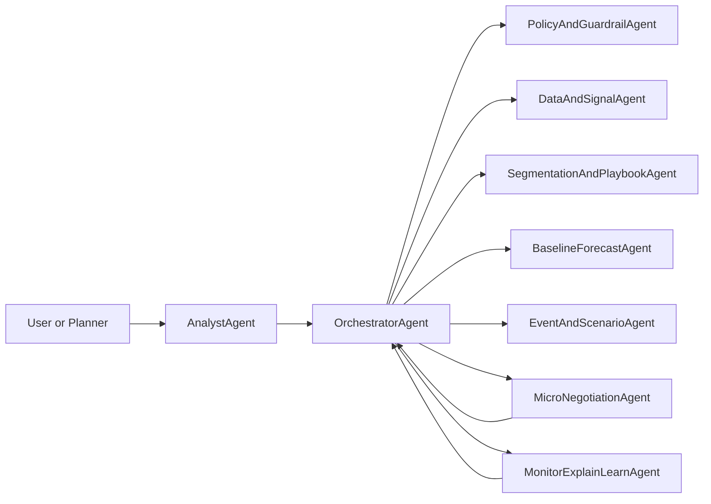
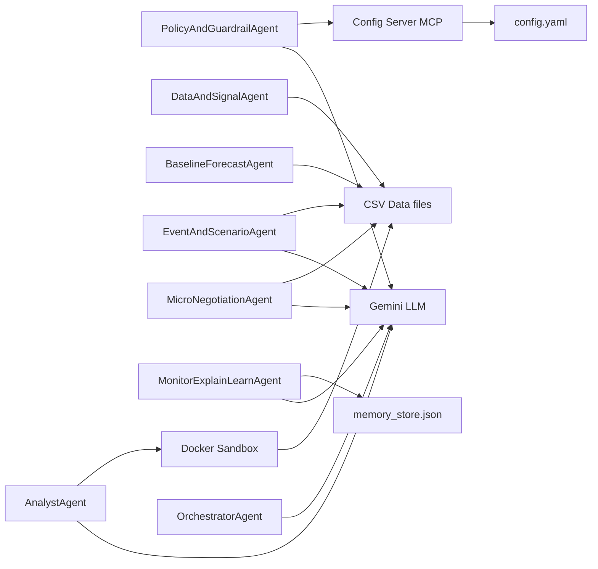
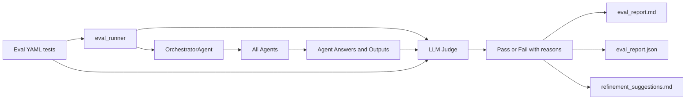

### Problem Statement

Demand planning today is still heavily dependent on rigid batch processes, spreadsheets, and single “forecast runs”. Even when companies invest in advanced tools, planners end up stitching together data cleaning, forecasting, scenario analysis, and constraint handling by hand.

When you unpack it, **demand planning isn’t one step – it’s a chain of distinct jobs**:

1. **Observe & clean reality** – get reliable demand history and signals.  
2. **Understand structure** – segment SKUs/channels and identify drivers.  
3. **Form baseline beliefs** – build probabilistic baselines, not just one number.  
4. **Layer business initiatives & events** – promos, launches, price changes.  
5. **Propagate across hierarchy & network** – keep views consistent across SKUs, families, locations, channels.  
6. **Generate, compare & stress-test scenarios** – plan / upside / downside under constraints.  
7. **Negotiate & commit** – reconcile demand vs supply vs policy and agree a plan.  
8. **Monitor, explain & learn** – track error, explain misses, and update playbooks.

Most real-world setups treat this as a monolith and hide these jobs inside tools and PowerPoints. That makes it hard to (a) trust the data, (b) see how business policies and constraints shape the plan, and (c) understand *why* the final numbers look the way they do.

This project asks: **can we turn those eight jobs into a strategy-guided, explainable system where the heavy lifting is done by a team of specialized AI agents instead of scattered scripts and manual work?**

---

### Why Agents?

Those eight jobs behave like different roles in a planning organization:

- a “data steward” for **Observe & clean reality**  
- a “demand analyst” for **Understand structure** and **Form baseline beliefs**  
- a “trade marketing / events owner” for **Layer initiatives & events**  
- a “supply/demand coordinator” for **Propagate**, **Generate scenarios**, and **Negotiate & commit**  
- a “process owner” for **Monitor, explain & learn**

Agents are a natural fit because they let us:

- **Mirror real roles and responsibilities** – each agent owns one or two of the jobs-to-be-done and has a clear contract.  
- **Compose complex behaviour** – an Orchestrator coordinates agents into an end-to-end workflow instead of one monolithic model.  
- **Keep humans and strategy in the loop** – a Policy Agent injects strategy and guardrails, while an Analyst/Monitor Agent explains outcomes in natural language.

The value isn’t “one smarter forecast model”; it’s a **cooperative system of focused agents** working across all eight jobs.

---

### What I Created – Overall Architecture

The project implements a **hub-and-spoke multi-agent architecture** aligned with the eight jobs:

- **Policy Agent** – reads planning rules and constraints; anchors **Negotiate & commit** in explicit policy.  
- **Data Agent** – loads historical sales, cleans anomalies, fills gaps, engineers features (**Observe & clean reality**).  
- **Segmentation Agent** – classifies SKUs by pattern/volatility and assigns a forecasting “playbook” (**Understand structure**).  
- **Baseline Agent** – applies segment-specific models to generate baseline forecasts and simple uncertainty (**Form baseline beliefs**).  
- **Scenario Agent** – layers events (promos/launches) on top of the baseline and produces Plan/Up/Down scenarios (**Layer initiatives & events**, **Generate & compare scenarios**).  
- **Negotiation Agent** – applies a capacity constraint and prioritises SKUs using policy-driven scores, logging cuts (**Propagate under constraints**, **Negotiate & commit**).  
- **Monitor Agent** – evaluates plan quality, tracks basic metrics, and preserves “learnings” for future runs (**Monitor, explain & learn**).  
- **Analyst / Chat Agent** – answers natural language questions over the shared state (“Why was SKU_005 cut?”, “Show history for SKU_001”).

All of these are coordinated by an **Orchestrator**, which runs the planning cycle and passes state between agents.

### Agent Interaction Architecture


---

### ✅ Implemented Concepts

**I. Core Agent Architecture**

- **Taxonomy Level 3 (Collaborative Multi-Agent System)**  
  We moved beyond a single LLM to a **team of specialists** (Policy, Data, Forecast, Negotiation, Monitor, Analyst) working together.

- **Orchestration Layer (The Nervous System)**  
  `OrchestratorAgent` (`orchestrator.py`) manages shared state, sequences agents (Sequential Pattern), and handles data handoffs.

- **Agent Definition**  
  Each agent (e.g., `NegotiationAgent`) has a clear **goal** (resolve capacity issues) and **autonomy** (decide which SKUs to cut within guardrails).

---

**II. Reasoning & Planning**

- **ReAct (Reason and Act)**  
  A `BaseAgent` abstraction implements the core loop: think/plan → call tools → observe results → iterate.

- **Model Routing**  
  The Orchestrator and API route user queries to the right specialist:  
  - “Why…?” → `AnalystAgent`  
  - “What is the policy…?” → `PolicyAgent`.

- **Context Engineering**  
  We use `set_system_instruction` for each agent to define persona, scope, and constraints, so each behaves like its role (e.g., strict Policy vs exploratory Analyst).

---

**III. Tools & Execution**

- **Built-in Tools (Code Execution)**  
  `AnalystAgent` can generate and execute Python code to query data (e.g., filter DataFrames, compute aggregates).

- **Sandboxing (Security)**  
  We wired a Docker Sandbox for `AnalystAgent`, so any LLM-generated code runs in an isolated container rather than directly on the host.

- **Data Stores**  
  Structured CSV files (`sales_data.csv`, `final_plan.csv`, etc.) serve as the data layer for the PoC.

---

**IV. Model Context Protocol (MCP)**

- **Architecture**  
  Implemented a full MCP **Client–Host–Server** pattern for configuration.

- **Server**  
  `servers/config_server.py` exposes `get_policy_config` and reads from `config.yaml`.

- **Client**  
  `agents/policy_agent.py` connects over stdio and requests policy sections via tool calls instead of reading files.

- **Standardization**  
  MCP cleanly decouples the “brain” (Policy Agent) from the “configuration source” (YAML), and the same pattern could point to a DB or API later.

---

**V. Memory**

- **Memory-as-a-Tool**  
  `MonitorAgent` and the Orchestrator use `utils/memory_store.py` to persist “learnings” and run history into `memory_store.json`, giving the system basic recall across runs.


---

**VI. Multi-Agent Patterns**

- **Hierarchical Pattern**  
  The Orchestrator acts as a manager, delegating tasks to worker agents.

-   **Hierarchical Pattern**  
    The Orchestrator acts as a manager, delegating tasks to worker agents.

-   **Sequential Pattern**  
    The planning cycle is an assembly line:  
    **Data → Segmentation → Baseline → Scenario → Negotiation → Monitor**.


---

**VII. Observability & Monitoring**

-   **Logging ("Agent's Diary")**  
    Implemented comprehensive logging in the Orchestrator, capturing agent outputs and making them visible in the UI as a trace of what happened in each step.

-   **State Tracking**  
    Full visibility into intermediate data (sales_data, segmentation, baseline forecasts, scenarios, final_plan) saved to disk for debugging and analysis.

---

**VIII. Evaluation Framework**

-   **Automated Testing Suite**  
    Implemented a comprehensive evaluation framework (`evals/`) with 21 tests across all 8 agents:
    -   **Deterministic Tests** (82% passing): Validate business logic and data transformations
    -   **LLM-as-a-Judge Tests** (60% passing): Evaluate explanations and reasoning quality

-   **Test Coverage**  
    -   Data quality tests (outlier detection, missing value handling)
    -   Forecast sanity checks (baseline generation, scenario application)
    -   Constraint enforcement (capacity limits, policy guardrails)
    -   Explanation quality (cuts, segments, policy questions)

-   **Ground Truth Validation**  
    Tests validate agent outputs against expected results with configurable tolerances and keyword matching.


---

**IX. Security & Configuration**

-   **Environment Variable Management**  
    Secure `.env` file setup for API keys using `python-dotenv`, preventing accidental credential exposure in version control.

-   **Multi-Turn Tool Execution**  
    `AnalystAgent` implements sophisticated multi-turn conversations: executes tools (like `query_data`), receives results, and generates human-readable interpretations.

-   **Q&A State Management**  
    All agents support question-answering mode where they maintain internal state (loaded data, segmentation, plans) to answer ad-hoc queries.

---

### ❌ Not Yet Implemented (Opportunities for V2)

-   **RAG (Retrieval-Augmented Generation)**  
    No vector DB or embeddings yet; agents read config/data from files or structured tables, not from large document stores.

-   **A2A Protocol**  
    Agents communicate via Python calls and shared state through the Orchestrator, not via a standardized asynchronous JSON "agent-to-agent" protocol.

-   **Advanced Evaluation**  
    While we have a solid foundation (71% tests passing), opportunities remain for:
    -   More sophisticated prompt engineering
    -   Edge case handling in Q&A scenarios
    -   Automated evaluation in CI/CD pipeline

-   **Self-Evolving System (Level 4)**  
    The system cannot create new tools or agents by itself; topology and tools are defined manually.

---

## 📊 Results & Metrics

The system has been thoroughly validated through our comprehensive evaluation framework:

### Evaluation Results
- **Overall Pass Rate:** 15/21 tests (71%)
- **Deterministic Tests:** 9/11 tests passing (82%)
- **LLM-Judged Tests:** 6/10 tests passing (60%)

### Agent Performance
- **5 Agents at 100%:** BaselineForecast, DataSignal, Policy, Monitor, MicroNegotiation (deterministic)
- **Strong Performance:** AnalystAgent (5/7, 71%), SegmentationAgent (2/3, 67%)
- **All Core Functions Validated:** Data cleaning, forecasting, capacity enforcement, policy retrieval, monitoring

### Key Validations
✅ Capacity constraints properly enforced  
✅ Data quality checks working (outlier detection, missing values)  
✅ Forecast generation accurate  
✅ Policy rules correctly retrieved and applied  
✅ Explanations generated for cuts and decisions  
✅ Multi-turn conversations functional

See `evals/README.md` and `walkthrough.md` for detailed test results.

---

### If I Had More Time…


With more time, I would:

- Add **richer segmentation and forecasting** (promo-sensitive / intermittent segments, better models, explicit hierarchy reconciliation).  
- Introduce **formal human-in-the-loop** steps for critical decisions from the Negotiation Agent and teach the system from overrides.  
- Replace the simple capacity-cut logic with a **multi-objective optimiser** (revenue, margin, service, inventory).  
- Extend into **medium-/long-term horizons**, giving the Policy Agent deeper strategic inputs and linking short-term agent decisions to S&OP.  
- Implement **RAG + A2A** to make agents more autonomous and better at using large knowledge bases while still respecting MCP-based tool boundaries.

That would take this from a vertical slice PoC to a more complete **Agentic Demand Planning System** grounded in real enterprise patterns.


# Agentic Demand Planning PoC

## 🎯 Goal
The goal of this project is to demonstrate an **Autonomous Agentic System** for Supply Chain Demand Planning. We aim to move beyond traditional, static planning tools by creating a system where specialized AI agents collaborate to:
1.  Ingest and clean sales data.
2.  Apply business policies and guardrails.
3.  Generate baseline forecasts.
4.  Simulate scenarios (promotions, events).
5.  Negotiate constraints (capacity, budget).
6.  Explain the "Why" behind the plan to human planners.

## 🚀 What This PoC Shows
This Proof of Concept (PoC) showcases a **vertical slice** of the end-to-end planning process. It demonstrates how a "Team of Agents" can be orchestrated to solve a complex business problem that typically requires multiple human roles.

Key highlights:
*   **Orchestration**: A central Orchestrator managing the workflow between specialized agents.
*   **Tool Use**: Agents using Python tools (Pandas, etc.) to perform rigorous data analysis.
*   **Transparency**: Full visibility into agent logs and reasoning (e.g., "Why was this SKU cut?").
*   **Interactive UI**: A chat-based interface combined with rich data visualizations (Charts, Tables).

## ⚡ Capabilities
The current system includes the following specialized agents:

1.  **Policy Agent**: Retrieves and enforces business rules (e.g., "Max promo uplift is 50%").
2.  **Data Agent**: Loads, cleans, and detects anomalies in historical sales data.
3.  **Segmentation Agent**: Analyzes volatility to classify SKUs (e.g., High/Low Volatility).
4.  **Baseline Agent**: Generates statistical baseline forecasts.
5.  **Scenario Agent**: Layers business events (promotions, launches) onto the baseline.
6.  **Negotiation Agent**: Checks capacity constraints and makes "cuts" to the plan where necessary, logging the reasons.
7.  **Monitor Agent**: Reviews the final plan and generates a summary report.
8.  **Analyst Agent**: A chat-based agent that can query the data to answer ad-hoc user questions (e.g., "Show me sales for SKU_001", "Why was this cut?").

## 🛠️ How to Run

### Prerequisites
*   Python 3.10+
*   Docker (for the sandboxed code execution environment)
*   Google Gemini API Key (or compatible LLM key)

### Installation
1.  **Clone the repository**:
    ```bash
    git clone <repo-url>
    cd AgenticDemandPlanning
    ```

2.  **Create and activate a virtual environment**:
    ```bash
    python -m venv venv
    source venv/bin/activate  # On Windows: venv\Scripts\activate
    ```

3.  **Install dependencies**:
    ```bash
    pip install -r requirements.txt
    ```

4.  **Build the Docker Sandbox**:
    ```bash
    cd sandbox
    docker build -t pandas-sandbox .
    cd ..
    ```

5.  **Set up Environment Variables**:
    Create a `.env` file in the project root:
    ```bash
    # Copy the example file
    cp .env.example .env
    
    # Edit .env and add your API key
    # GOOGLE_API_KEY=your_api_key_here
    ```
    See `API_KEY_SETUP.md` for detailed instructions.

### Running the Application
Start the backend API and frontend server:
```bash
uvicorn api:app --reload
```
Open your browser and navigate to: `http://127.0.0.1:8000`

### Running Tests
Run the evaluation suite to validate all agents:
```bash
# Run all tests
python -m evals.eval_runner

# Run tests for a specific agent
python -m evals.eval_runner --suite analyst
python -m evals.eval_runner --suite policy
```

See `evals/README.md` for detailed testing documentation.

## 🏗️ Architecture
The system follows a **Hub-and-Spoke** architecture:
*   **Orchestrator**: The "Manager" that maintains state and calls other agents in sequence.
*   **Agents**: Stateless workers that perform specific tasks. They receive context (DataFrames, Policy Dicts) and return updated artifacts.
*   **Shared State**: Data is passed between agents as Pandas DataFrames, ensuring consistency.

## 📁 Project Structure

```
AgenticDemandPlanning/
├── agents/               # All agent implementations
├── evals/                # Evaluation framework and tests
├── servers/              # MCP server (config_server)
├── ui/                   # Frontend HTML/CSS/JS (if any)
├── sandbox/              # Docker sandbox for code execution
├── utils/                # Utilities (memory_store, etc.)
├── .env.example          # Template for environment variables
├── config.yaml           # Business rules and constraints
├── orchestrator.py       # Main orchestration logic
├── README.md             # Project documentation (this file)
└── requirements.txt      # Python dependencies
```

## 🛠️ Development & Contributing

- **Adding a new agent**: Create a class in `agents/`, inherit from `BaseAgent`, implement `run()` and any required tools. Register the agent in `orchestrator.py`.
- **Writing tests**: Add a YAML file under `evals/` following the existing schema. Run `python -m evals.eval_runner --suite <agent>` to validate.
- **Code style**: Follow PEP8, use type hints, and run `ruff`/`black` before committing.
- **Pull requests**: Ensure all tests pass (`python -m evals.eval_runner`) and that the documentation is updated.

## 🐞 Troubleshooting

- **Docker sandbox errors**: Verify Docker is running and you have permission to build images. Re‑run `cd sandbox && docker build -t pandas-sandbox .`.
- **Missing `GOOGLE_API_KEY`**: Ensure a `.env` file exists at the project root (copy from `.env.example`) and contains `GOOGLE_API_KEY=your_key`.
- **Import errors**: Activate the virtual environment (`source venv/bin/activate`) and reinstall dependencies (`pip install -r requirements.txt`).
- **Evaluation failures**: Check `evals/eval_report.md` for detailed reasons. You can run a single test with `python -m evals.eval_runner --suite <agent> --test <test_id>` to isolate issues.
